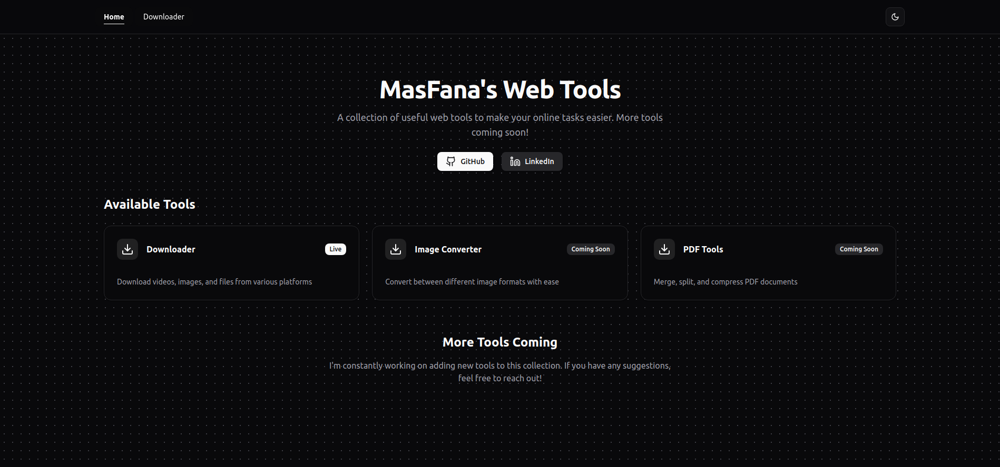

# MasFana's FanTools

A collection of web tools for downloading content from various social media platforms, built with React, TypeScript, Tailwind CSS, and ShadCN UI components.

 <!-- Replace with actual screenshot -->

## Features

- **Multi-platform Downloader**: Download content from:
  - YouTube
  - Instagram
  - TikTok
  - Twitter/X
  - Facebook
  - Pinterest
- **Modern UI**: Clean, responsive interface with dark/light mode
- **Easy to Use**: Simple paste-and-download workflow
- **Fast Performance**: Built with Vite for quick development and production builds

## Technologies Used

- ⚛️ React 19
- 📜 TypeScript
- 🎨 Tailwind CSS
- 🛠️ ShadCN UI Components
- ⚡ Vite
- 🚦 TanStack Router
- 📱 Responsive Design

## Getting Started

### Prerequisites

- Node.js (v18+ recommended)
- npm or pnpm (included with Node.js)

### Installation

1. Clone the repository:
   ```bash
   git clone https://github.com/masfana/fanatools.git
   cd fanatools
   ```

2. Install dependencies:
   ```bash
   npm install
   # or
   pnpm install
   ```

3. Start the development server:
   ```bash
   npm run dev
   # or
   pnpm dev
   ```

4. Open your browser to [http://localhost:3000](http://localhost:3000)

### Building for Production

```bash
npm run build
# or
pnpm build
```

The production build will be in the `dist/` directory.

## Project Structure

```
fantools/
├── src/
│   ├── components/       # Reusable UI components
│   ├── lib/              # Utility functions and types
│   ├── routes/           # Application routes
│   ├── main.tsx          # Application entry point
│   └── styles.css        # Global styles
├── public/               # Static assets
├── vite.config.ts        # Vite configuration
└── tsconfig.json         # TypeScript configuration
```

## Available Scripts

- `dev`: Start development server
- `build`: Create production build
- `serve`: Preview production build
- `test`: Run tests
- `lint`: Run ESLint
- `format`: Format code with Prettier
- `check`: Run both linting and formatting

## Adding Components

This project uses ShadCN UI components. To add a new component:

```bash
pnpx shadcn@latest add [component-name]
```

## Contributing

Contributions are welcome! Please open an issue or submit a pull request.

---

Built with ❤️ by MasFana
